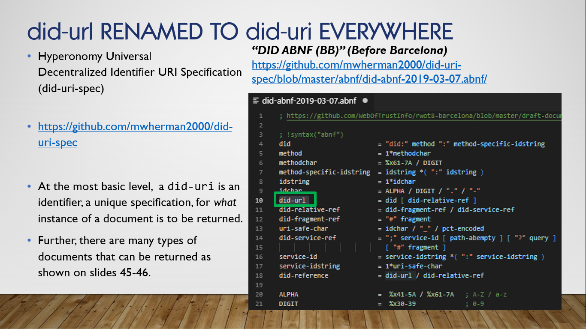
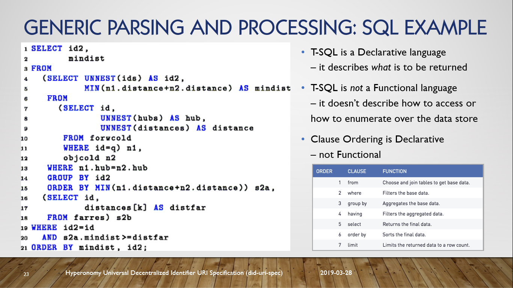

# Hyperonomy Universal Decentralized Identifier URI Specification (`did-uri-spec`)

_Draft document for discussion purposes_

- Michael Herman (Toronto/Calgary/Seattle)
- Hyperonomy Business Blockchain Project / Parallelspace Corporation
- March 2019

Update cycle: As required - sometimes several times in a single day.

## `did-uri-spec` Frequently Asked Questions (FAQ)

1. What about Joe Andrieu's comment that a DID reference is a URI rather than a URL.
   - At the top, everything has been renamed from `did-url` to `did-uri` - even the github project URL.
   - THe following slide 3 has been added to the deck.  These thoughts actually do a good job og summarizing the entire rest of the presentation.



Figure 1. Slide 3

2. How does the SQL example applying to the `did-uri` discussion?. Are you saying that DID dereferencing should be what, not how? 
  - The answer is closely related to question #1 above. A SQL Server T-SQL query statement specifies _what_ is to be returned a result - not the algorithms, indices, caching strategies, physical access patterns/protocols are to be used.
  - In this sense, if the underlying data in SQL Server data store was ummutable, a T-SQL query would also be an indentifier describing the data table to be returned - not a DID identifier but it doesn't conform the the `did-uri` gramamar.



Figure 2. Slide 23

3. You mention the feature discovery and attachment HIPEs as examples of higher-level DID user scenarios, but I'm not seeing the connection between them and the DID-URI spec. 
   - See the answers to question #4 and question #5 below.

4. In a later slide, you suggest `<did>!$attachmentId` as an A2A use case. The use of `attachmentId` makes total sense to me and might make me vote to ditch `nickname`--but what puzzles me is the use of <did> at the front of the expression. 
   - I start by advocating that `nickname` be changed to `id` (or as @telegramsam suggests `@id`) and that is have a derefencible `did-uri` containing their fully-qualified `did-uri` or a relative `fragmentId`.
   - The above would enable derefencing of a single attachment or collection of attachments from a `DIDComm` message using a standard `did-uri` parser compliant with the `did-uri` grammar.

```json
{
  "@type": "https://lawenforcement.org/messages/csi/2.0/evidence",
  "location": "40.4973268,-111.9041778",
  "case_num": 12345,
  "notes": "I took a shot matching what the witness reported. See `view 1`.",
       "": " The other shot matches what the victim remembers. See `view 2`.",
  "~attach": [
    {
      "nickname": "view 1",
      "mime-type": "image/png",
      "filename": "IMG1092348.png",
      "lastmod_time": "2018-12-24 18:24:07Z",
      "description": "view from doorway, facing east, with lights off",
      "data": {
        "base64": "aGVsbG8sIHl ...(many bytes omitted)... Ugd29ybGQ="
      }
    },
    {
      "nickname": "view 2",
      "mime-type": "image/png",
      "filename": "IMG1092349.png",
      "lastmod_time": "2018-12-24 18:25:49Z",
      "description": "view with lamp in the background",
      "data": {
        "base64": "29yVsbG8GQs ...(many bytes omitted)... aGUgdbIHl="
      }
    }
  ]
}
```

Figure 4.1. Current `crime-scene.json`

```json
{
  "@type": "https://lawenforcement.org/messages/csi/2.0/evidence",
  "location": "40.4973268,-111.9041778",
  "case_num": 12345,
  "notes": "I took a shot matching what the witness reported. See `view 1`.",
       "": " The other shot matches what the victim remembers. See `view 2`.",
  "~attach": [
    {
      "id": "#view1",
      "mime-type": "image/png",
      "filename": "IMG1092348.png",
      "lastmod_time": "2018-12-24 18:24:07Z",
      "description": "view from doorway, facing east, with lights off",
      "data": {
        "base64": "aGVsbG8sIHl ...(many bytes omitted)... Ugd29ybGQ="
      }
    },
    {
      "id": "#view2",
      "mime-type": "image/png",
      "filename": "IMG1092349.png",
      "lastmod_time": "2018-12-24 18:25:49Z",
      "description": "view with lamp in the background",
      "data": {
        "base64": "29yVsbG8GQs ...(many bytes omitted)... aGUgdbIHl="
      }
    }
  ]
}
```

Figure 4.2. Future `crime-scene.json`

NOTE: In Figure 4.2, the `nickname` attribute has been renamed and "re-valued" relative to Figure 4.1.

5. Are you imagining that a message id (@id) = a DID? Likewise, you talk about feature discovery with a filter after <did> -- but I was thinking of it as a query on an agent, which isn't a DID.
   - See the answer to question #4 above.  The answer is: yes - more likely a relative `did-uri` vs. a fully-qualified `did-uri`.